## 第一章、Linux基础篇

### 1、Linux入门

#### 1.1、Linux介绍

1. Linux 是一款操作系统，其具备的优点是

   - 免费
   - 开源
   - 安全
   - 高效
   - 稳定
   - 十分擅长处理高并发
   - 很多企业级项目都会部署到 Linux服务器上面运行

2. Linux主要的发行版本

   

#### 1.2、Linux和Unix的关系

**Unix是由Linux演变出来的**

#### 1.3、CentOS安装的步骤

CentOS的安装注意事项：

虚拟机Vmware要安装好

步骤：

1. 创建虚拟机

2. 开始安装系统（CentOS 8）

3. 安装完成的后界面为

   

网络连接的三种模式：

1. 桥接模式：当某个用户的计算机（ip：192.168.0.10）里面创建一个虚拟机系统时（CentOS），该虚拟机的ip就直接为当前用户计算机ip的基础上作出变化，也就是192.168.0是固定的，例如（192.168.0.30），且其他计算器可以通过该ip地址访问到该计算机和计算机下的虚拟机。不过桥接模式有个缺点就是：因为192.168.0是固定的，所以用户创建的虚拟机最多只能创建200多个，超出这个数量之后就会造成虚拟机ip地址的重复，产生冲突。
2. NAT模式：Linux可以访问外网且不会产生ip冲突
3. 主机模式：不能访问外网

#### 1.4、终端使用和联网

1. 终端

   

2. 联网

   点击虚拟机有上角的有线设置，把网络开启即可

   

#### 1.5、vmtools的安装和使用

介绍：

vmtools安装后，可以让我们在windows下更好管理vm虚拟机

1. 可以直接粘贴命令在windows和centos系统之间
2. 可以设置windows和centos的共享文件夹

安装步骤：

共享文件夹

完成之后即可在虚拟机上输入该些命令去找到这个共享的文件夹myshare，步骤如下：

1. 先已root的管理权限进入文件夹mnt

2. 在mnt/目录下找到hgfs

3. 然后在进入hgfs即可找到共享文件夹myshare

   

#### 1.6、文件系统目录结构

Linux不像windows有那么多目录，Linux的文件系统是采用级层式的树状目录结构，在此结构中的最上层是根目录“ / ”，然后在此目录下再创建其他的目录。

Linux的目录分为

- /bin：该目录下存放着最经常使用的命令
- /sbin：系统管理员使用的系统管理程序
- /home：存放普通用户的主目录，在Linux中每个用户都有自己的目录，一般该目录名是以用户的账号来命名的
- /root：系统管理员的用户主目录
- /lib：系统开机所需要最基本的动态连接共享库
- /lost+found：这个目录一般情况下是空的，当系统非法关机后，这里就存放了一些文件
- /etc：所有的系统管理所需要的配置文件和子目录
- /usr：用户的很多应用程序和文件都放在这个目录下，类似windows下的program files目录
- /boot：存放启动Linux时使用到的核心文件，包括一些连接文件以及镜像文件
- /tmp：存放一些临时文件
- /dev：把所有的硬件以文件的形式存储
- /media：Linux会自动识别一些设备，例如u盘、光驱等，当识别后，Linux会把识别的设备挂载到这个目录下
- /mnt：系统提供该目录时为了让用户临时挂载别的文件系统的，我们可以将外部的存储挂载在/mnt上，然后进入该目录就可以查看到里面的内容了，如共享文件一样
- /opt：这是给主机额外安装软件所摆放的目录，如安装oracle数据库时就可以放在改目录下（即安装包）
- /usr/local：这是另外一个给主机额外安装软件所安装的目录，一般是通过编译源码的方式安装的程序
- /var：这个目录中存放着在不断扩充着的东西，习惯将经常被修改的目录存放在这个目录下，包括各种日志文件
- /selinux：是一种安全子系统，它能控制程序只能访问特定文件

总结：

1. Linux的目录中有且只有一个根目录“/”
2. Linux的各个目录的内容都是规划好的，不能乱放文件
3. Linux是以文件的形式管理我们的设备

## 第二章、Linux实操篇

### 1、远程登录Linux服务器

**为什么要远程登录Linux服务器？**

因为实际操作的Linux系统都不会是在本机，而是在其他的机房上面，通常使用xshell来登录到远方的Linux系统

**如何把本机文件传到远端的Linux服务器上面？**

使用软件xftp

- 远程登录Linux-Xshell

  1. 安装Xshell并使用

  2. 查询到Linux服务器的IP地址：输入命令：ifconfig

     

  3. 将其ip输入到xshell中，然后点击连接即可

     

  4. 然后输入Linux服务器上面的用户名和密码即可

     

  5. 连接成功

     

### 2、远程上传下载文件xftp

1. xftp的介绍：sftp、ftp文件传输软件，使用xftp以后，windows用户能安全地在Unix/Linux和Windows PC之间传输文件

2. xftp的配置和使用：

   - 配置：

     

     当连接成功后会出现以下界面：

     

### 3、vi和vim编辑器的使用

1. vi和vim的基本介绍：所有的Linux系统都会内建vi文本编辑器；vim具有程序编辑能力，可以看做是vi的增强版本。

2. vi和vim的常见三种模式

   - 正常模式：我们可以在该模式下使用快捷键
   - 插入模式（编辑模式）：我们可以在该模式下可以输入内容，通常按“i”即可进入模式
   - 命令行模式：在这个模式下，可以提供给你相关的指令，完成读取、存盘、替换、离开vim、显示行号等动作就是在此模式中达成

3. 使用vim开发一个hello.java程序

   - 注意：使用命令：wq退出当前编辑并保存修改；：q！退出当前编辑但不可以保存修改

     

4. 快捷键：

   - 命令模式下输入“/你所要查找到的关键字”即可搜索关键字

   - 命令模式下输入“：set nu  / ：set nonu” 即可设置文件行号和取消文件行号

     

   - .跳转到指定行：首先命令模式下输入 ：set nu 后显示行数，然后输入要跳转的行数，接着按下shift+g即可

   

### 4、用户关机、重启和用户登录注销

#### 4.1、关机、重启命令

1. shutdown
   - shutdown -h now：表示立即关机
   - shutdown -h 1：表示一分钟后关机
   - shutdown -r now：立即重启
2. halt：就是直接使用，效果等效于关机
3. reboot：重启系统
4. sync：把内存的数据同步到磁盘上，利用这个命令可以让你关机的时候把未保存的数据自动保存在磁盘上，在执行shutdown指令的时候，都应当执行sync指令

#### 4.2、用户登录和注销

1. 用户注销

   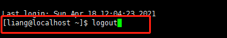

2. 用户登录

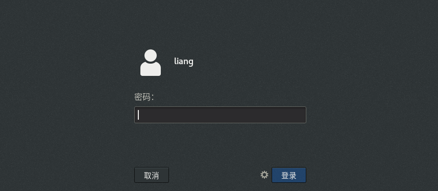

### 5、用户管理

#### 5.1、创建用户指定密码

1. 基本介绍：Linux系统是一个多用户多任务的操作系统，任何一个要使用系统资源的用户，都必须首先向系统管理员申请一个账号，然后以这个账号的身份进入系统

2. 添加用户命令：useradd 用户名

   - 当用户创建成功之后，会自动的创建和用户同名的家目录，例如useradd xm，那么他对应的家目录便是：/home/xm
   - 也可以通过useradd -d指定目录 新的用户名，给新创建的用户指定家目录

3. 事例：

   - 当没指定创建的用户是哪个组的时候，系统会自动创建一个同用户名一样命名的组，例如创建一个java组

     

   - useradd -d tiger java：创建一个用户名为springboot，但是家目录为/home/spring的用户

     

     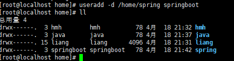

4. 切换目录的命令：su 用户名

5. 给用户指定密码：passwd 用户名（只有root权限才可以进行操作） 

#### 5.2、删除用户

1. 删除用户命令：userdel 用户名

2. 删除用户分为两种删除方式：

   - 删除用户xxx，但是要保留家目录：userdel 用户名
   - 删除用户以及家目录：userdel -r 用户名

   

#### 5.3、组的管理

1. 系统可以对有共性的多个用户进行统一的管理

2. 基本命令：

   - groupadd  用户组：增加组

   - useradd -g  用户组  用户名 ：增加用户时直接上组

     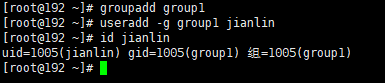

   - groupdel 用户组：删除组（若组里面有用户存在的话，要先删除组里面的用户才可以删除组）

     

   - usermod -g  用户组 用户名：修改用户的组

     

#### 5.4、用户和组的相关文件

1. vim /etc/passwd：用戶配置文件（存放用戶信息）

   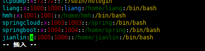

2. vim /etc/group：组配置文件（存放组信息）

   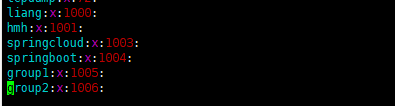

3. vim /etc/shadow：口令配置文件（存放密码和登录信息，这些信息是加密的）

   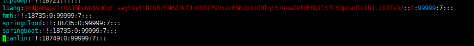

4. 注意：若看不到用户信息，点击shift+g即可

## 第三章、Linux实操篇

### 1、实用指令

#### 1.1、运行级别和找回root密码

1. 运行级别说明：（centos8目前只支持运行级别3和5）

   - 0：关机

   - 1：单用户（找回丢失密码）

   - 2：多用户状态没有网络服务

   - 3：多用户状态有网络服务

   - 4：系统未使用保留给用户

   - 5：图形界面

   - 6：系统重启

   - 常用运行级别是3和5，要修改默认的运行级别可改文件/etc/inittab 的id：5:initdefault:这一行中的数字

     

2. 切换到指定运行命令的指令：init【0123456】

3. **Q：如何找回root的密码？**

   **A：进入单用户模式，然后修改root的密码即可。因为单用户模式下root不需要密码就可以登录。**（而这一步的操作必须要在服务器上面进行，远程是不能操控的）

#### 1.2、帮助命令

1. 说明：当我们对某个指令不熟悉的时候，我们可以使用Linux提供的帮助指令来了解这个指令的使用方法（当然百度一下也是可以的）

2. 基本语法：man【功能或配置文件】

   

   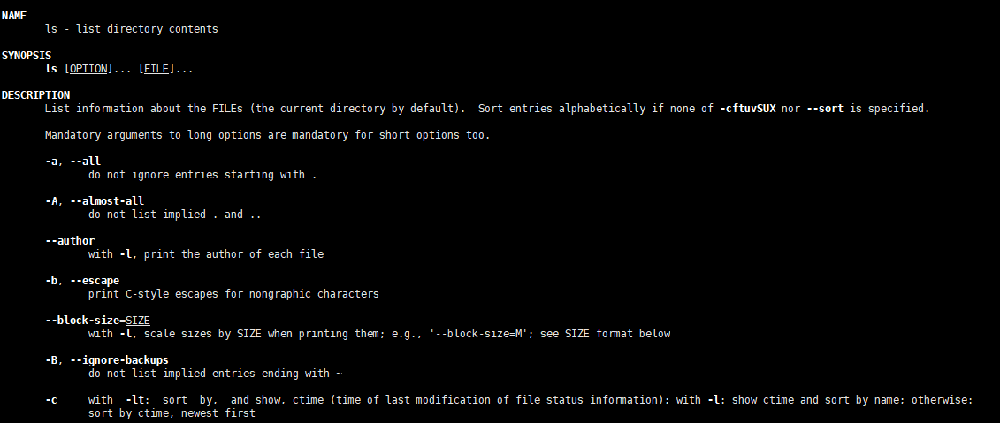

3. 基本语法2：help 命令 【获得shell内置命令的帮助信息】

   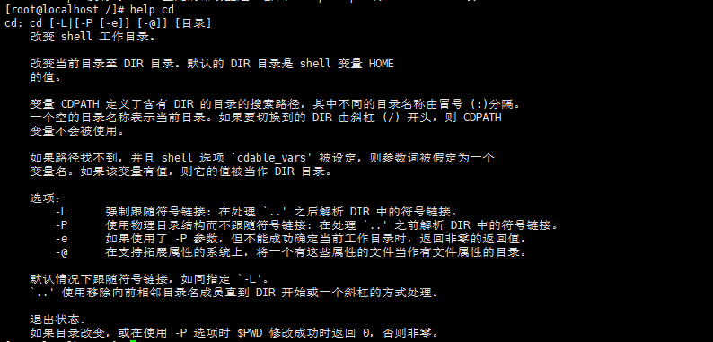

#### 1.3、文件目录类指令

1. pwd指令：显示当前目录的绝对工作命令

   

2. ls指令：查看当前目录的所有内容信息

   - ls -a：显示当前目录的所有的文件和目录，包括隐藏的

     

   - ls -l：以列表的形式展现（和 ll命令一样）

     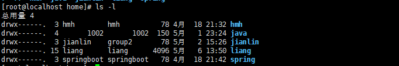

3. cd指令：切换到指定目录

   - cd .. ：切换到上一级的目录
   - cd~或cd ： ：回到自己的家目录

4. mkdir指令：指定用于创建目录

   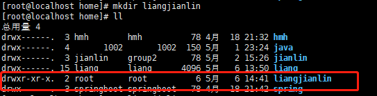

5. mkdir -p指令：创建多级目录

   

6. rmdir指令：删除空目录

   

7. rm -rf指令：删除非空目录

   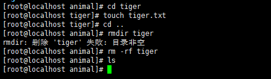

8. touch指令：创建空文件（一个和多个文件）

9. cp指令：拷贝文件到指定目录

   - cp：复制单个文件

     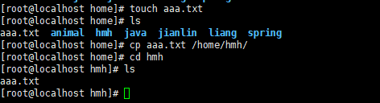

   - cp -r：复制多个文件

10. rm指令：移除文件或目录

    

    - rm -r：递归删除整个文件夹

      

    - rm -f：强制删除不提示

      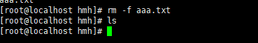

11. mv指令：移动文件与目录或重命名

    - 重命名

      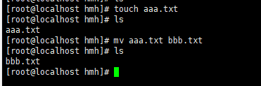

    - 移动文件

      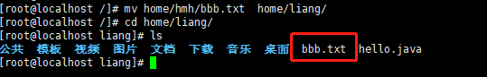

12. cat指令：查看文件（只读）

    - cat  -n  ：查看文件的同时显示行号

      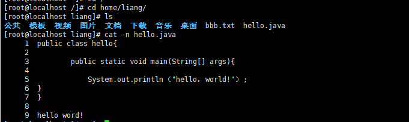

13. more指令：是一个基于vi编辑器的文本过滤器，他以全屏的方式按页显示文本文件的内容

    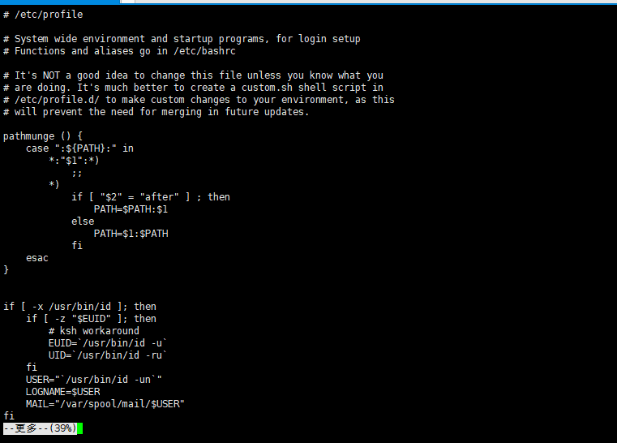

14. less指令：分屏查看文件内容，功能与more相似但是指令更加强大，支持各种显示终端，less指令在显示文件内容时，并不是一次将整个文件加载之后才显示，而是根据显示需要加载内容，对于显示大型文件具有较高的效率；page up：上一页 ；page down：下一页

15. ">" 指令：

16. ">>"指令：

17. grep指令：它能使用正则表达式搜索文本，并把匹配的行打印出来

    - grep【关键词】 地址

      

18. echo指令：进行总结，并给出示例，方便记忆与回顾 

    

19. head指令：显示文件的行数

    

    - head -n 【num】【文件名】：显示该文件前num行

      

    - head -c 【num】【文件名】：显示该问价前n个字节

      

    - head -q  【文件名1】【文件名2】：显示多个文件内容

    

20. tail指令：【tail -n [行数] filename】监视文件的尾部内容

    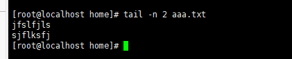

21. history指令：用于查看历史使用过的命令

    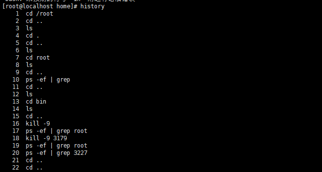

22. ln指令：ln -s 【原文件或目录】【软链接名】软链接，类似于Windows里的快捷方式，主要存放了链接其他文件的路径的语法

    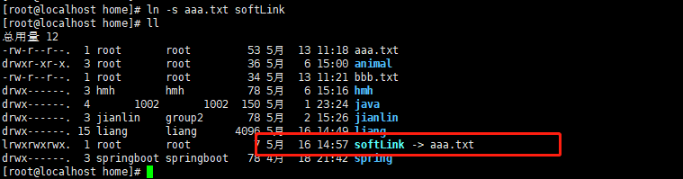

23. gzip指令：【gzip 文件】用于压缩文件，只能将文件压缩为*.gz文件，当我们使用该指令进行压缩文件时，不会保留原文件

    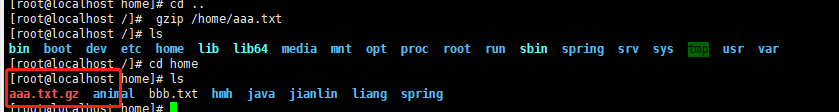

24. gunzip指令：【gunzip文件.gz】用于解压文件

    

25. zip指令：【zip -r【.zip】【目录】】：递归压缩整个目录 

    

26. unzip指令：【unzip -d【目录】【.zip】】：指定解压到某个目录上

    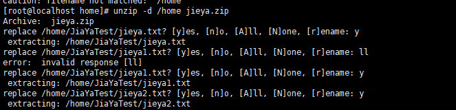

27. tar指令：打包指令，最后打包后的文件是.tar.gz的文件

28. 基本语法：tar 【选项】 xxx.tar.gz（打包目录，压缩后的文件格式.tar.gz）

    1. 选项说明：（通常-zcvf同时使用）

       - -c：产生.tar打包文件

       - -v：显示详细信息

       - -f：指定压缩后的文件名

       - -z：打包同时压缩

       - -x：解包.tar文件

         

    2. 压缩整个目录：tar -zcvf  myhome.tar.gz /home

       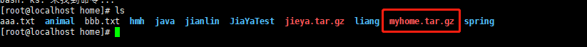

29. 解压指令：tar -zxvf  【.tar.gz文件】

    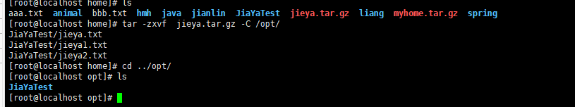

    

### 2、组管理和权限管理（重点、难点）

1. Linux组基本介绍：在Linux中的每个用户必须属于一个组，不能独立于组外。在Linux中每个文件有所有者、所在组、其他组的概念

   1. 文件/目录**所有者**：一般文件的创建者，谁创建了该文件，就自然的成为了该文件的所有者

      1. 查看文件的所有者指令：ls -ahl或 ll

      2. 修改文件所有者：chown 用户名 文件名

         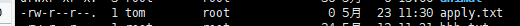

      3. 修改文件所在的组：chgrp 组名 文件名

         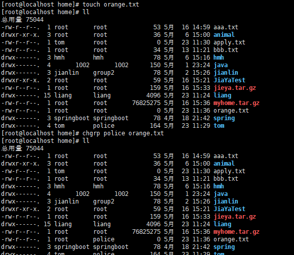

         

2. 其他组：除文件的所有者和所在组的用户外，系统的其它用户都是文件的其它组

3. 改变用户所在组：在添加用户时，可以指定将该用户添加到哪个组中，同样的root的管理权限可以改变某个用户所在的组

4. 改变用户所在组

   - usermod -g 组名 用户名

     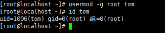

   - usermod -d 目录名  用户名  改变该用户登录的初始目录

5. 权限的基本介绍

   6. 文件权限对应关系：

      - x：可执行

      - r：可读

      - w：可写

        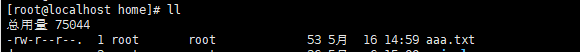

6. 更改权限指令：chmod 【选项模式】 文件名

   - 修改权限的方式

     1. "+" "-" "="方式【u：所有者、g：所有组、o：其他人、a：所有人】：chmod u=rwx ,g=rx,o=x 文件目录名

        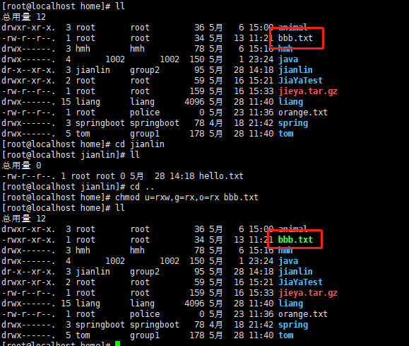

     2. 通过数字变更权限：r=4,w=2,x=1、rwx=4+2+1=7

        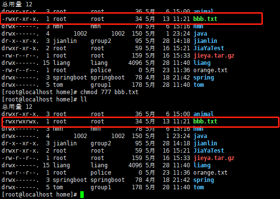

7. 修改文件所有者指令：chown

8. 改变文件的所有者：chown newowner file 

   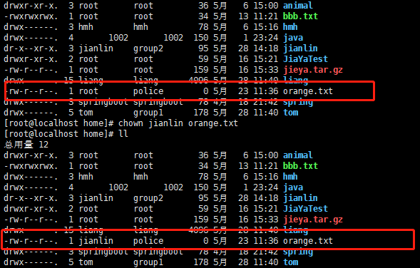

9. 改变文件的所有者和所有组：chown newowner：newgroup file 

   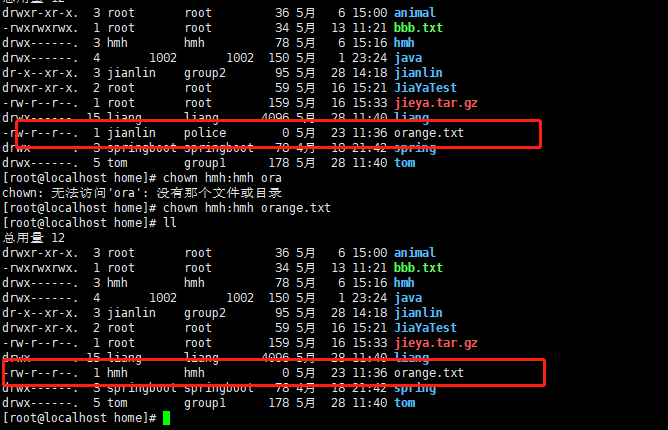

10. -R：如果是目录，则使其下的所有子文件或目录递归生效

### 3、任务调度（crond）

1. 任务调度的基本说明：系统在某个时间执行的特定的命令和程序

2. 任务调度的分类：

   - 系统工作：有些重要的工作必须周而复始的执行，比如病毒扫描等
   - 个别用户工作：个别用户可能希望执行的某些程序，比如对mysql数据库的备份

3. 基本语法：crontab 【选项】

   - crontab -e：编辑crontabl定时任务（下图表示每天每小时每分钟都要执行一次将/etc下的文件输入到to.txt中）

      

      

   - crontab -l：查询crontab任务

   - crontab -r：删除当前用户所有的crontab任务

4. 
