# Linux

## 第一章、Linux基础篇

### 1、Linux入门

#### 1.1、Linux介绍

1. Linux 是一款操作系统，其具备的优点是

   - 免费
   - 开源
   - 安全
   - 高效
   - 稳定
   - 十分擅长处理高并发
   - 很多企业级项目都会部署到 Linux服务器上面运行

2. Linux主要的发行版本

   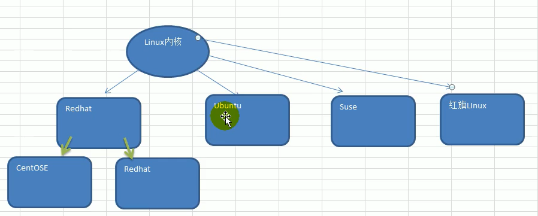

#### 1.2、Linux和Unix的关系

**Unix是由Linux演变出来的**

#### 1.3、CentOS安装的步骤

CentOS的安装注意事项：

虚拟机Vmware要安装好

步骤：

1. 创建虚拟机

2. 开始安装系统（CentOS 8）

3. 安装完成的后界面为

   

网络连接的三种模式：

1. 桥接模式：当某个用户的计算机（ip：192.168.0.10）里面创建一个虚拟机系统时（CentOS），该虚拟机的ip就直接为当前用户计算机ip的基础上作出变化，也就是192.168.0是固定的，例如（192.168.0.30），且其他计算器可以通过该ip地址访问到该计算机和计算机下的虚拟机。不过桥接模式有个缺点就是：因为192.168.0是固定的，所以用户创建的虚拟机最多只能创建200多个，超出这个数量之后就会造成虚拟机ip地址的重复，产生冲突。
2. NAT模式：Linux可以访问外网且不会产生ip冲突
3. 主机模式：不能访问外网

#### 1.4、终端使用和联网

1. 终端

   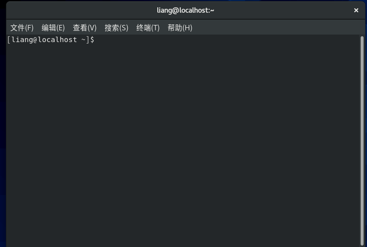

2. 联网

   点击虚拟机有上角的有线设置，把网络开启即可

   

#### 1.5、vmtools的安装和使用

介绍：

vmtools安装后，可以让我们在windows下更好管理vm虚拟机

1. 可以直接粘贴命令在windows和centos系统之间
2. 可以设置windows和centos的共享文件夹

安装步骤：

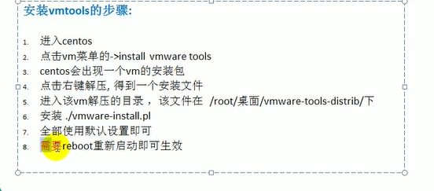

共享文件夹

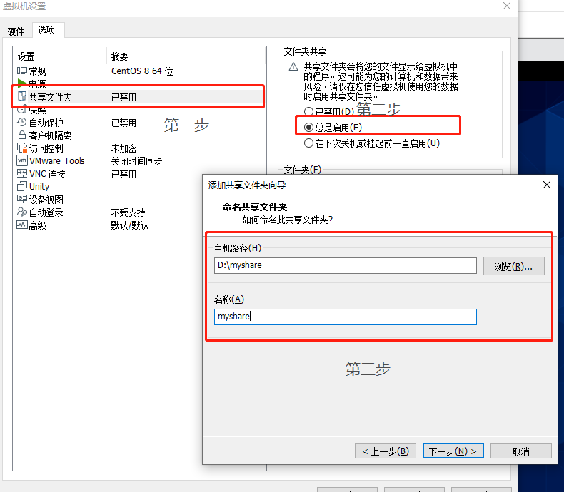

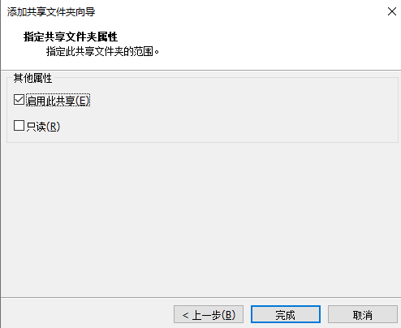

完成之后即可在虚拟机上输入该些命令去找到这个共享的文件夹myshare，步骤如下：

1. 先已root的管理权限进入文件夹mnt

2. 在mnt/目录下找到hgfs

3. 然后在进入hgfs即可找到共享文件夹myshare

   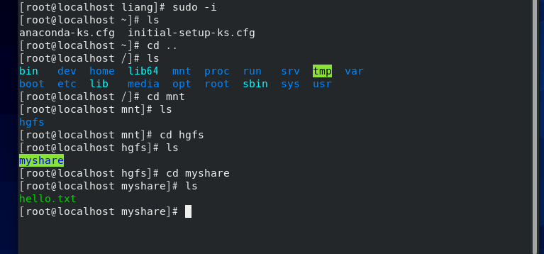

#### 1.6、文件系统目录结构

Linux不像windows有那么多目录，Linux的文件系统是采用级层式的树状目录结构，在此结构中的最上层是根目录“ / ”，然后在此目录下再创建其他的目录。

Linux的目录分为

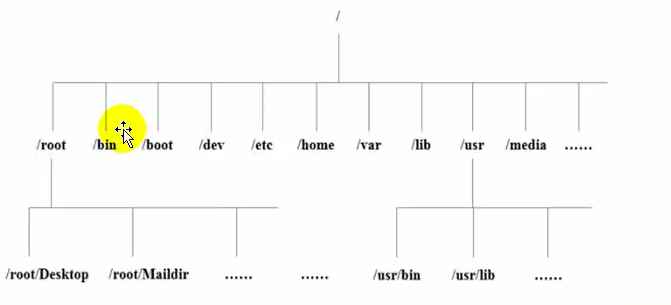

- /bin：该目录下存放着最经常使用的命令
- /sbin：系统管理员使用的系统管理程序
- /home：存放普通用户的主目录，在Linux中每个用户都有自己的目录，一般该目录名是以用户的账号来命名的
- /root：系统管理员的用户主目录
- /lib：系统开机所需要最基本的动态连接共享库
- /lost+found：这个目录一般情况下是空的，当系统非法关机后，这里就存放了一些文件
- /etc：所有的系统管理所需要的配置文件和子目录
- /usr：用户的很多应用程序和文件都放在这个目录下，类似windows下的program files目录
- /boot：存放启动Linux时使用到的核心文件，包括一些连接文件以及镜像文件
- /tmp：存放一些临时文件
- /dev：把所有的硬件以文件的形式存储
- /media：Linux会自动识别一些设备，例如u盘、光驱等，当识别后，Linux会把识别的设备挂载到这个目录下
- /mnt：系统提供该目录时为了让用户临时挂载别的文件系统的，我们可以将外部的存储挂载在/mnt上，然后进入该目录就可以查看到里面的内容了，如共享文件一样
- /opt：这是给主机额外安装软件所摆放的目录，如安装oracle数据库时就可以放在改目录下（即安装包）
- /usr/local：这是另外一个给主机额外安装软件所安装的目录，一般是通过编译源码的方式安装的程序
- /var：这个目录中存放着在不断扩充着的东西，习惯将经常被修改的目录存放在这个目录下，包括各种日志文件
- /selinux：是一种安全子系统，它能控制程序只能访问特定文件

总结：

1. Linux的目录中有且只有一个根目录“/”
2. Linux的各个目录的内容都是规划好的，不能乱放文件
3. Linux是以文件的形式管理我们的设备

## 第二章、Linux实操篇

### 1、远程登录Linux服务器

**为什么要远程登录Linux服务器？**

因为实际操作的Linux系统都不会是在本机，而是在其他的机房上面，通常使用xshell来登录到远方的Linux系统

**如何把本机文件传到远端的Linux服务器上面？**

使用软件xftp

- 远程登录Linux-Xshell

  1. 安装Xshell并使用

  2. 查询到Linux服务器的IP地址：输入命令：ifconfig

     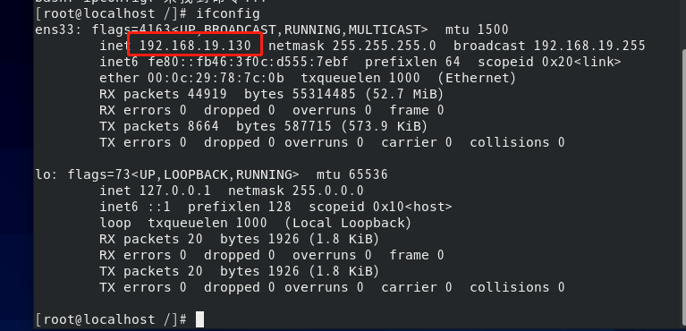

  3. 将其ip输入到xshell中，然后点击连接即可

     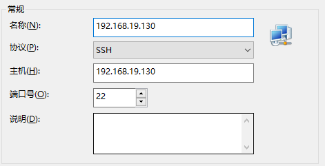

  4. 然后输入Linux服务器上面的用户名和密码即可

     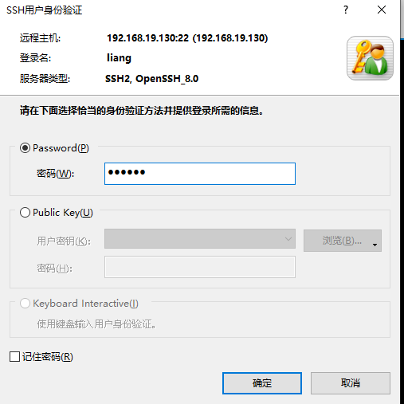

  5. 连接成功

     

### 2、远程上传下载文件xftp

1. xftp的介绍：sftp、ftp文件传输软件，使用xftp以后，windows用户能安全地在Unix/Linux和Windows PC之间传输文件

2. xftp的配置和使用：

   - 配置：

     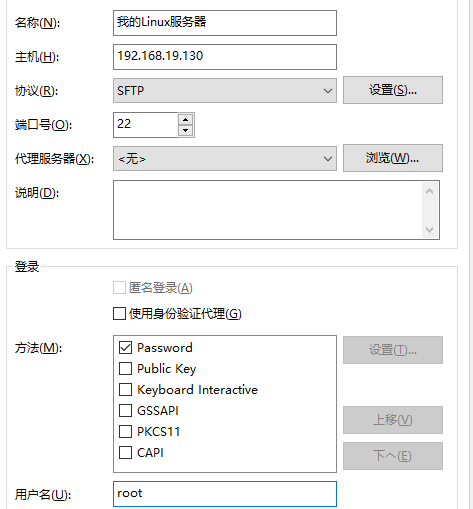

     当连接成功后会出现以下界面：

     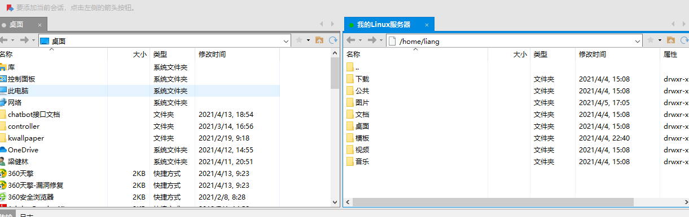

### 3、vi和vim编辑器的使用

1. vi和vim的基本介绍：所有的Linux系统都会内建vi文本编辑器；vim具有程序编辑能力，可以看做是vi的增强版本。

2. vi和vim的常见三种模式

   - 正常模式：我们可以在该模式下使用快捷键
   - 插入模式（编辑模式）：我们可以在该模式下可以输入内容，通常按“i”即可进入模式
   - 命令行模式：在这个模式下，可以提供给你相关的指令，完成读取、存盘、替换、离开vim、显示行号等动作就是在此模式中达成

3. 使用vim开发一个hello.java程序

   - 注意：使用命令：wq退出当前编辑并保存修改；：q！退出当前编辑但不可以保存修改

     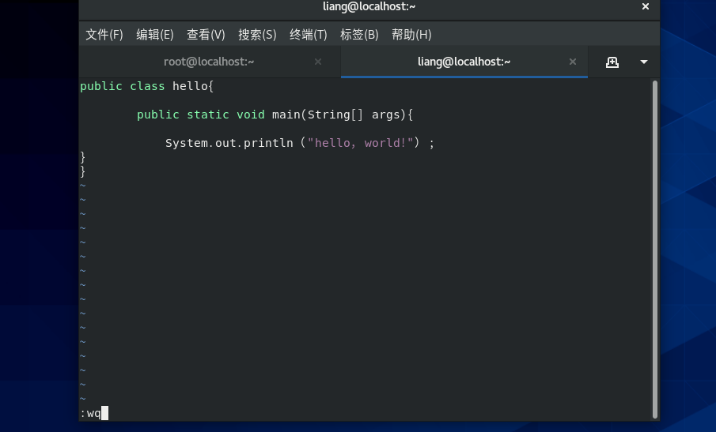

4. 快捷键：

   - 命令模式下输入“/你所要查找到的关键字”即可搜索关键字

   - 命令模式下输入“：set nu  / ：set nonu” 即可设置文件行号和取消文件行号

     

   - .跳转到指定行：首先命令模式下输入 ：set nu 后显示行数，然后输入要跳转的行数，接着按下shift+g即可

   

### 4、用户关机、重启和用户登录注销

关机、重启命令

### 5、

### 

