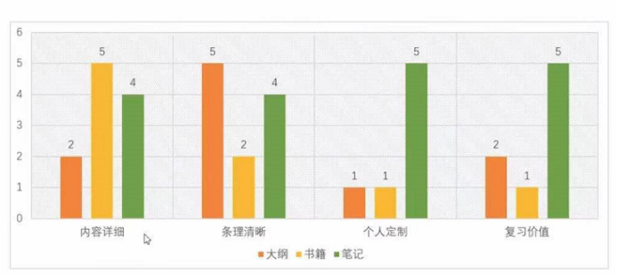
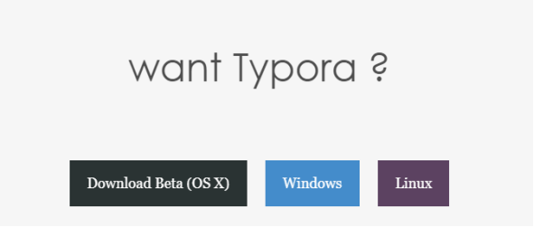
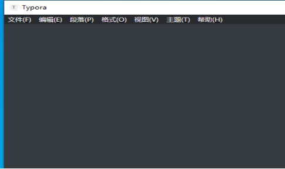
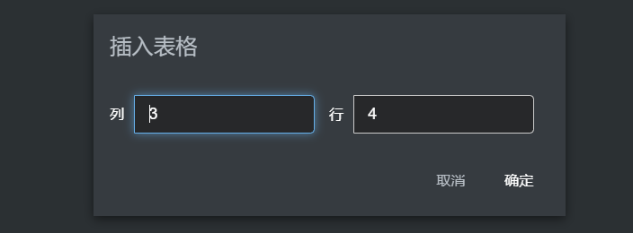
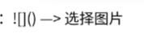
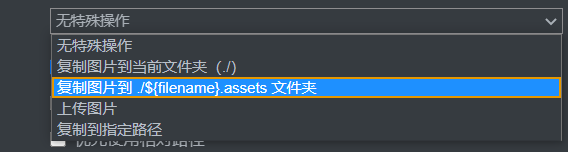

# Markdown语言的学习以及应用

## 一、重新认识笔记

### 1、课程说明

课程共分为上阶段、下阶段：

1. 上阶段(说明笔记的相关知识)

   - 笔记的价值是什么？
   - 优秀笔记有什么标准？
   - 怎么样写出属于自己的优秀笔记？

2. 下阶段

   - Markdown的基本语法及其实践运用

     

### 2、认识笔记的重要性

  **Q1:为什么一定要写属于自己的笔记呢？**
  因为在学生读书时代当我们把知识完全学习掌握的时候一定要经历3个步骤：课本->板书->笔记，三个步骤缺一不可，
但是最重要的一步还是笔记（写出一份属于自己的笔记），因为当当只有课本或者是课本->板书这两步是会有缺点的：

1. 课本的知识非常全面而且术语非常的严谨且抽象，如果单看课本的话很难把课本的术语转变成自己的知识。

2. 课本->板书比单单课本来说确实优化了很多，因为老师在列板书的时候是把课本的重难点知识给统一总结出来的，并且
   对重难点有一定的扩展，相对于课本来说板书的知识没有那么的繁琐和抽象，很大的改善了课本的缺点，但是同时板书也存
   在着缺点，板书是面向全体学生的，而每个学生的学习水平都是不一样的，有水平好的也有水平差的，水平好的就可以理解
   老师写出来的板书，但是水平不好的学生就会理解的比较吃力，所以这就是板书的缺点。
   而自己写出来的笔记呢是只面向与自己的，他是自己从板书上面理解的知识然后通过自己的理解和学习而写出来的，这样
   保证了写出来的知识自己是完全听懂的且在你写笔记的过程中也会对知识进行加深理解和记忆。

   **Q2：所以优秀笔记的标准是什么？**

   1. 知识条理清晰明了
   
   2. 重难点突出

   3. 符合个人定制化的一些需求(例如一些重难点的自我扩展等等)

      
   

### 3、笔记的重新定位

1. 笔记，是真正能留在脑子里的东西。（如下图3-1）

   

   ​                                                                                                     图3-1

   **通过比较得出：**

   - 书籍在内容详细方面较大纲和笔记的都要详细很多，书籍内含有大量且全面的知识点，较与大纲上的总体概括

     以及笔记上面的自己挑重点来概括与总结的都要全很多；

   -  虽然书籍的内容非常的全面，但是书籍里面的内容大多数充满着专业术语，这是非常抽象的，人们往往看书籍

     一般都很难一次性把书籍完全看懂，而在条例清晰这方面，大纲的条例最为清晰不过，因为大纲的内容是最少的但是

     要传达的内容却是很全面并且突出重难点，教育工作者（教师）也是要看着大纲来编写属于自己的教学方针。

   -   笔记的最大特点根据图表可以看出它的个人定制性是最强的，因为每个人的笔记都是独特的也是最适合自己的，

     因为他是自己通过学习理解而记录下来的知识点，所以他的重难点是非常突出的而且可以把自己记录下来的重难点进

     行扩展，所以他的个人定制性很强，一本笔记只专属于一个人。         

     ​                                                                      

### 4、优秀笔记的标准

1. 重点突出

   重点突出表现在对书本中所有知识点的一个提炼。

2. 条理分明

   条例分明表现在对笔记记下的重难点进行梳理，具体的梳理方式包括重难点的进一步概括以及细化、把重难点具有
   特点进行分点描述并且建立知识框架，使自己复习自己的笔记更加的轻松方便。

3. 量身定做

   量身定做，也就是笔记的独特性，每一份笔记都是不一样的，因为不同的人对书本的重难点详细程度提炼不一，对
   重难点的课外扩展成都也不一样，所以自己的笔记是最适合自己用来复习的，笔记就是自己为自己量身定做的。
   
   

### 5、笔记工具的选择

1. 各种笔记工具的参数对比如下图5-1所示。

   

   ​                                                                                                   图5-1

2.  记事本：记事本是最基本的记录工具，其操作难度是最低的，但由于全都是以文字的形式来记录， 并未加入任何的思维框架以及图形，所以记事本的表现能力是极差的，而且会给我们造成阅读疲劳以及对复习重难点时候的模糊感而导致的复习疏漏，所以其条理方面的能力也是最低的。

3.  word文档：word文档的表现能力以及条例清晰方面非常强，无论是在图表方面展示还是在逻辑方面。但是word文档所需求的操作技术比其他三个工具都要繁琐以及要求的技术也比其他三个工具要高。

4.  标记语言：标记语言的上手难度不高，但是其表现能力极强，和操作复杂繁多的word文档的表现力不相上下，而且在条例方面虽说没有思维导图来的这么的直观清晰，但是也只是稍逊一筹而已。

5.  思维导图（X-mind）：思维导图最直接的关系就是点与点之间的扩散关系（中心点->多点->多点），它具有非常多条例清晰的框架供我们使用而且这些框架所展示出来的关系是非常明确的，所以在条理清晰方面思维导图是最优的，但是虽然点与点之间的关系都有在思维导图中展示出来，但是这种关系都是概括性的，不是表现得很详细，所以在表现能力方面上并没有标记语言以及word文档要高。

**综上所述：在结合了操作、条理以及表现这三点来看，标记语言是最平均得并且平均水平也是最高的，所以在选择笔记工具的话会优先选择使用标记语言。**

## 二、Markdown语言以及Typora的应用

### 1、Markdown语言的简介

​    Markdown是由John Gruberis开发的轻量级标记语言，使用的笔记工具是Typora。

   **Q:为什么要使用Typora笔记工具呢？**

1. Typora是Markdown语言体现的载体。

2. Typora上手的成本非常低，因为Typora软件是免费面向使用者的。

3. 使用Typora的话我们只用关心编写的笔记内容而无需关心笔记的格式以及排版。

   

### 2、Typora的下载

1. 进入Typora官网：https://www.typora.io/  

2.  点击官网右上方的下载安装按钮Download 。(如下图2-1)

   

   ​                                                                                         图2-1

3.  进入下载页面后选择电脑需要的软件版本，这里选择Windows x64的版本。(如下图2-2)

   

   ​                                                                                                    图2-2

4.  完成下载后方可安装Typora并且运行。(如下图2-3)

​                                                                                                          图2-3

### 3、多级标题的使用

1. 多级标题的操作就是使用“# 这是第（几）级标题”，并且井号键的数量与标题级数相匹配，如图8-1和8-2所示。

   

   ​                                                                                             图8-1

   

   

   ​                                                                                             图8-2

   

   - 这里要注意的问题就是#字符后面一定要先空格在加文字，否则这个操作是不成功的，井号键后面的字体并没有加深，如图8-3所示。

     

     ​                                                                                     图8-3

     

     

   - 然后若是输入二级标题的话就是“## 这是第二级标题”；三级标题就是“### 这是第三级标题”，以此类推，如图8-4所示。

     

     ​                                                                                 图8-4

2. 我们也可以使用快捷键Ctrl+1~6即可对标题进行分级，具体操作就是把鼠标的光标移到你想要分级的标题上面，然后使用快捷键即可对其进行操作分级，而快捷键Ctrl+0则是移除标题的分级效果的，如图8-5 。

   

   ​                                                                                      图8-5

   

   - 而取消分级的话操作如下图8-6所示

     

     ​                                                                               图8-6
  
     

   **Q1：为什么分级快捷键中的数字只能是1-6呢？**

   因为在markdown的语法中，最多仅支持我们把标题分为6级，及高于6级的话是不会继续分级下去的，所以不仅是快捷键中只支持Ctrl+1~6,而且用井号键来分级也是最多只能写到六个井号键，如果写了七个井号键则语法失效。

   
   
   **综上所述：让标题分级一共有2个方法：第一个是运用markdown的语法来实现对标题的分级：# 这是第一级标题；第二个方法就是把光标移动到标题处并选中标题，利用快捷键Ctrl+数字1~6来实现对标题的分级；而Ctrl+数字0则是清楚标题的分级效果。**
   
   

### 4、有序列表的使用

1. 有序列表就是一个点里面还分有几个小点，具体的markdown语法操作如下：“数字”+“.”+“空格”+“内容”即可，如图9-1所示。

   

   ​                                                                                          图9-1

   

2. 当再次按下空格之后，markdown会自动换行分点，如图9-2所示。

   

   ​                                                                                          图9-2

   

3. 若想要在大点下面分出几个小点，则只需要选中所要降级的点，然后点击tab键即可。如图9-3和9-4所示。

   

   ​                                                                                          图9-3

   

   

   ​                                                                                          图9-4

   

4.  若想要将小点转换成大点，只需选中所要升级的点，然后点击Shift+Tab键即可。如图9-5和图9-6所示。

   

   ​                                                                                          图9-5

   

   ​                            

   ​                                                                                          图9-6 

   

5. 若想快速的生成有序列表，还可以使用快捷键（但是本人觉得快捷键比平时不用快捷键也快不了多少），方法就是选中所需要生成有序列表的文本，然后同时输入Ctrl+Shift+[ 键即可实现生成有序列表，如图9-7和9-8所示。

   

   ​                                                                                         图9-7

   

   

   ​                                                                                         图9-8

   

### 5、无序列表的使用

1. 无序列表的具体操作就是“*”+“空格”+“文本内容”，例如输入“* 教导主任”则会出现如下图10-1所示的结果。

   

   ​                                                                                         图10-1

   

   - 继续按下空格键，则会自动生成。如图10-2所示。

     

     ​                                                                                  图10-2

     

2.  而无序列表下插入一个无序列表就和有序列表的降级操作一致，只需要选中文本并且按下Tab键即可，如图10-3和10-4所示。 若想让文本升级，则也是先选中文本，点击Shift+Tab键即可，就能恢复到图10-3的样子。 

   

   ​                                                                                                 图10-3

   

   

   ​                                                                                                  图10-4

   

3.  若想在无序列表中插入有序列表并且实现分级，则可以从图10-4的基础下选中要改变成有序列表的文本，按下变成有序列表的快捷键Ctrl+Shift+[ 键即可，如图10-5所示。

   

   ​                                                                                                      图10-5

   

   - 若想把里面的有序变成无序，则只需要按下快捷键 Ctrl+Shift+] 键即可。如图10-6所示。

     

     ​                                                                                  图10-6

   
   

### 6、任务列表的使用

1. 格式：“-”+“空格”+“中括号[+空格+]”+“空格”+“文本内容”，如下图11-1和11-2所示。

   

   ​                                          图11-1

​                                             图11-2

2. 注意：

- -、[、]后面都一定要加空格，否则命令不生效；

- 任务列表并无快捷键，只能通过鼠标进行操作：选中的文字-->段落-->任务列表

  

### 7、插入表格的操作

1. 格式：“|”+文本内容+“|”+文本内容+“|”+文本内容+“|”+文本内容+“|”-->回车，如图12-1和图12-2所示。

​                                                            图12-1

​                                                                                      图12-2

2. 注意：只需要按着Ctrl + 回车就可以添加一行表格，如下图12-3所示。

   

   ​                                                                                        图12-3

3. 图表上方共有7个按键，从左-->右分别是：

   - 调整表格的样式，他可以让表格得到进一步的扩展也可以使表格得到缩减，比如现在的表格是4X1，可以把他扩大成4X2，也可以

     把它缩减成3X1。

   - 对表格文本框的格式进行操作：

     1. 对表格文本框的内容进行左对齐的操作。
     2. 对表格文本框的内容进行居中对齐的操作。
     3. 对表格文本框的内容进行右对齐的操作。

   - 更多列表的操作，如：

     1. 上、下方插入行。
     2. 左、右侧插入列。
     3. 删除行。
     4. 删除列。
     5. 复制表格。
     6. 格式化表格源码。
     7. 删除表格。

   - 删除表格操作。

4. 创建表格的快捷键：Ctrl+T，然后选择所需要创建表格的行数和列数，点击确定即可快速创建表格，如下图12-4所示。

5. 

   ​                                                                                          图12-4

   

### 8、行内代码的使用

1. 创建方式：` ` ``
2. 快捷键：Ctrl+Shift+`
3. 注意："`" 符号一定要是在英文输入法的条件下才可以生效。

### 9、代码块

1. 创建方式：，如图14-1所示。

​                                                                              图14-1

~~~java
public class study{
    public Static void main(String[] args){
    System.out.println("好好学习，天天向上！");
}
}
~~~

2. 快捷键：Ctrl+Shift+K

   

### 10、插入图片

1. 创建方式：,然后选择图片存放的路径即可，如图15-1所示。

   

2. 快捷键：Ctrl+Shift+i

3. 提示：

   - 点击文件-->偏好设置-->图像，可以选择插入图片时，把图片自动复制在filename.assets的文件夹中(typora自动创建)，如图15-2所示。

     

     ​                                                                                          图15-2

     

   - 点击文件-->编号设置-->图像-->勾选优先使用相对路径，即可优先的使用相对路径下的图像，这样可以避免在图片换了位置的时候导致的图片丢失。如图15-3三所示。

     

     ​                                                                                   图15-3

