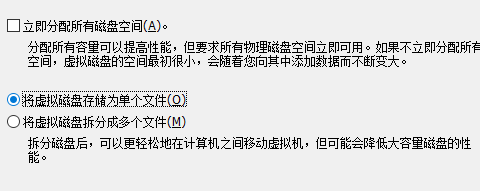
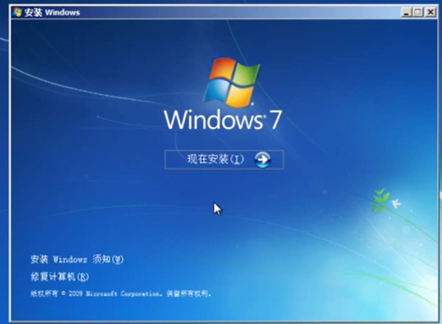
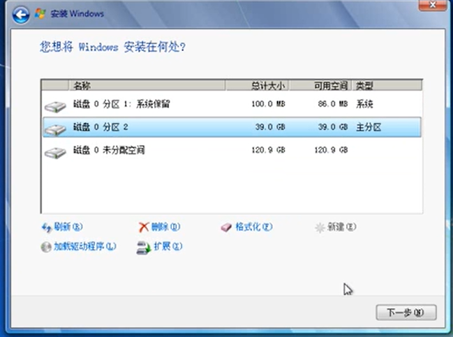
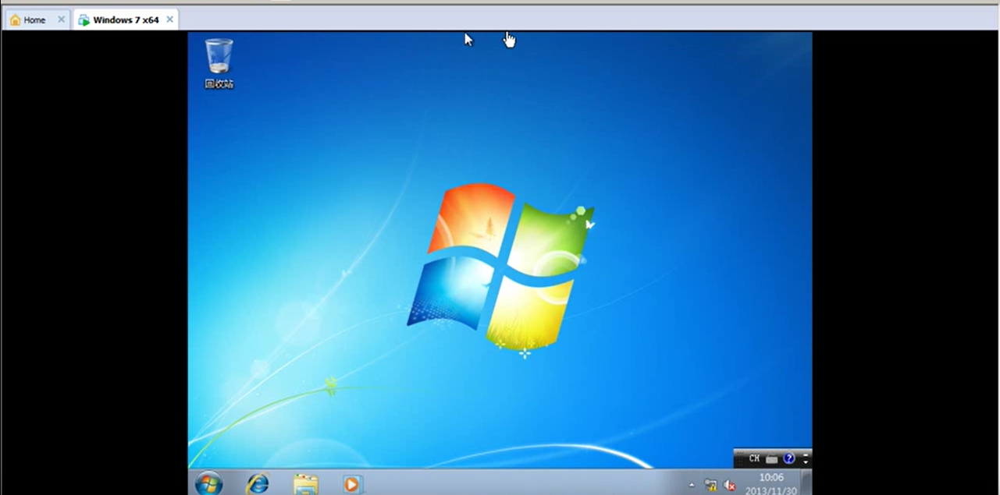
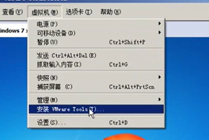
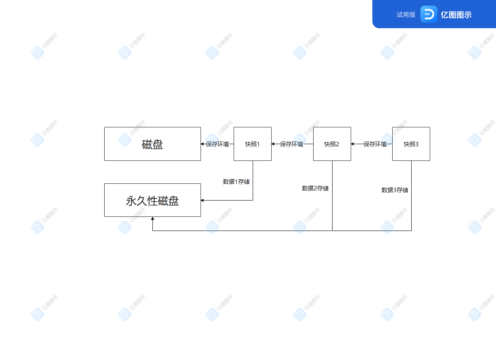
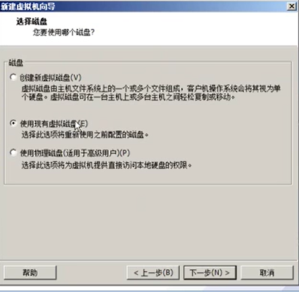

# Vmware虚拟机

## 第一章、虚拟化技术的特点

1. 在一台计算机运行多个操作系统
2. 可以搭建教学环境、测试环境
3. 和硬件的好坏无关
4. PtoV技术
   - 把物理机装的复杂应用直接放到虚拟机中，若物理机当机或损坏则可以直接使用虚拟机来使用应用，但是这个过程是不可逆的，也就是说虚拟机里的应用软件不能拷贝到物理机中
5. 节省管理成本
   - 一个优秀的服务器便可以搭出多个虚拟机，每个虚拟机可以管理不同的应用系统，比之前的一个服务器对应一个应用系统来说成本上是大大的减少的
6. 节省硬件投资
   - 多个虚拟机可以共同使用同一个硬件资源，可以使硬件资源使用最大化
7. 省电

## 第二章、在虚拟机中安装Windows7

1. 再分配虚拟机内存的时候，切记不要勾选立即分配所有磁盘空间和将虚拟磁盘拆分成多个文件，原因是：
   - 立即分配所有磁盘资源会把你设定的磁盘空间立刻拿出来，比如你设定了60g的空间，那么虚拟机就直接占用60g的空间，而不是根据虚拟机的实际大小来分配空间
   - 将虚拟磁盘拆分成多个文件会使文件散放在一个盘里，造成文件夹的不整洁

2. 进入虚拟机开始装系统，步骤如下：

   1. 点击安装按钮

      

   2. 磁盘分盘

      

      **Q：磁盘分盘为什么要分一个100M的磁盘?**

      **A:因为每个磁盘都有一个自我保护的功能，他是一个硬盘加密并且含有解密的功能，只有硬件在不变的条件下系统才能运行起来，这样可以防止虚拟机到了别人的电脑上面可以对他进行任意的数据修改以及数据拉取，所以一定会有这么一个100M的磁盘**

   3. 安装成功，为虚拟机设置名称以及密码

   4. 安装完成

      

## 第三章、在虚拟机中安装VM Tools

1. 安装原因：

   - VM Tools为硬件驱动，可以使虚拟机的运行速度变快；每个操作系统都有相对应的硬件驱动。
   - 支持物理机和虚拟机之间文件的复制粘贴功能
   - 可以使物理机和虚拟机的时间同步
   - 点击电源按钮之后可以正常的按步骤关机而不是直接关闭电源
   - 可以把虚拟机里面的东西展示到物理机上面

2. 安装步骤：

   1. 点击虚拟机

   2. 安装VMware Tools(若没反应，直接在光驱上面运行安装)

      

   3. 安装完成

   4. 重启虚拟机

      

## 第四章、虚拟机和物理机之间互相访问资源的几种方法

1. 物理机上直接拷贝，虚拟机里粘贴
2. 打开虚拟机设置选项-->启用共享文件夹-->勾选“在Windows客户机中映射为网络驱动器”选项-->添加共享文件夹的路径-->添加成功(文件拷贝到虚拟机中成功)
3. 把物理机和虚拟机的网络连通(要在物理机上面输入虚拟机上的网络ip)，不过该方法存在着一定的风险，因为要使得物理机通过该网络ip连接到虚拟机，首先要把虚拟机的防火墙给关闭

## 第五章、给虚拟机创建快照、删除快照

一、创建快照(即创建新的磁盘文件)

1.  虚拟机-->快照-->快照管理器-->拍摄快照(建议在虚拟机关机的时候启用快照)
2. 当保存快照至Windows 7x64.vmdk之后，该文件就变成了个只读文件，而虚拟机会创出一个新的文件叫Windows 7 x64-0000001.vmdk来进行读和写，所以下次打开虚拟机的时候也就是打开这个文件

二、删除快照

1. 快照管理器-->选中快照-->删除
2. 注意事项：删除快照的时候建议又最新的快照开始删，以免在删除的时候文件进行数据合并，影响效率

## 第六章、虚拟机快照使用永久磁盘保存用户数据

只需要把存放数据的盘做成永久盘，然后快照只对永久盘以外的盘进行快照，便可以在删除快照的时候把数据保存下来

添加永久写入磁盘具体步骤如下：

1. 硬盘

2. 添加硬盘

3. 把模式改成独立且永久(独立磁盘不受快照的影响并且所做的更改立即永久写入磁盘)

4. 设置磁盘大小并且将磁盘存储为单个文件

5. 创建完成

   

   

   

## 第七章、给虚拟机的硬盘添加保护卡

情景：往计算机上的c盘中添加保护卡，然后你可以磁盘进行操作，但是每当关机重启计算机的时候，你对该磁盘的操作会全部删除，这样就恢复到了原始的c盘，这就是在硬盘上面添加保护卡的作用。

1. 步骤：

   - 把磁盘设置成非永久磁盘

   

## 第八章、将物理机的硬盘和分区添加到虚拟机

步骤：

1. 打开虚拟机上的计算机管理
2. 为虚拟机添加一个盘
3. 勾选使用物理磁盘
4. 选择物理磁盘
5. 选择使用磁盘的分区(若虚拟机上面使用了该分区，那么物理机上面就不可以使用这个分区了)
6. 设置完毕

若磁盘使用完毕，点击磁盘，然后移除即可。

## 第九章、将虚拟机的硬盘挂载到物理机打开

步骤：

- 第一种步骤：
  1. 打开映射虚拟磁盘
  2. 已只读的模式映射到你所需要的磁盘(这里写的是Z盘)
  3. 点击确定即可
  4. 完成
- 第二种步骤：
  1. 选择虚拟机上的磁盘(系统盘也可以映射)
  2. 点击实用工具——>映射
  3. 映射到你所需要的磁盘（这里写的是Z盘）
  4. 点击确定即可
  5. 完成

## 第十章、使用安装了操作系统盘的vmdk创建虚拟机

1. 使用情景：若系统快照全部都坏掉或者丢失，则直接可以在vmdk上创建一个新的虚拟机。

2. 步骤：

   - 创建一个新的文件夹，然后把.vmdk的文件复制进去

     

   - 打开Vmware workspace，创建新的虚拟机（创建方式与上面的一致）

   - 在选择磁盘的时候选择 使用现有虚拟磁盘，选择.vmdk文件 

     

   - 创建虚拟机完成

## 第十一章、连接远程VMWareWorkstation共享的虚拟机

在本地计算机上面管理远程的VMWare虚拟机 ，步骤如下：

先用远程桌面软件对对远程计算机进行一个管理(前提是该远程计算机也安装了虚拟机)

点击编辑——>选项——>共享虚拟机——>选择存放的位置

## 第十二章、创建虚拟机模板，克隆新系统

## 第十三章、公网地址和私网地址 NAT技术

## 第十四章、交换机 路由器和网段之间的关系

## 第十五章、规划虚拟机的网络和网段

## 第十六章、虚拟机之间的通信

## 第十七章、在物理机上添加网卡连接到虚拟网络

## 第十八章、通过桥接模式将虚拟机连接到物理网络

## 第十九章、虚拟机网卡不能桥接的解决办法

## 第二十章、虚拟机使用VMWareNAT服务实现上网

## 第二十一章、使用Windows连接共享实现虚拟机上网

## 第二十二章、将物理机抓取到虚拟机的意义

## 第二十三章、将物理机抓取到虚拟机 远程抓取和本地抓取

## 第二十四章、配置虚拟机使用USB接口设备

## 第二十五章、抓取Linux到虚拟机