# 一、git的学习以及应用

## 第一章、git的含义

1. 分布式

2. 版本控制

   - 文件形式(多文件):一个版本对应一个文件。
   - 本地版本控制(一个文件)：一个文件里面有多个版本，而且通过本地的版本控制软件(或者一个命令)还可以实现对不同版本的统一管理。
   - 集中式的版本控制(svn)：把所有的版本都存放在了中央服务器上面，用户可以共同更新存放在服务器中的所有版本。但是集中式的版本控制有一个缺点：因为用户在写完一个版本上传到中央服务器时，是没有把该版本存放在本地服务器的，所以当中央服务器挂掉的时候会导致版本的缺失。
   - **分布式的版本控制：**分布式的版本控制与集中式的版本控制原理大同小异，也是把所有的版本放在了中央服务器上面，但是唯一不同的是，用户在上传新版本到中央服务器的时候，会首先把这个版本存放在自己的本地服务器里，在把这些版本同步到中央服务器中。所以当中央服务器挂掉的时候，也可以在自己的服务器中找到自己所写的版本，从而解决了因中央服务器挂掉而导致的版本缺失这一顾虑。

3. 软件

   **综上所述：git是一个分布式的版本控制软件。**

## 第二章、为什么要做版本控制

为什么要做版本控制呢？因为在做不同的事情的时候，基本上不会出现一步到位，一次就能做好的事情，例如模块功能的迭代，这就需要在初始的代码版本里不断的迭代出新的代码，而版本控制主要是：若新版本上线时突然发生的功能异常，那么员工就需要在使用新版本的上一个版本进行重新的迭代(也可以说时新版本的回滚)，这样可以使因错误而导致的功能异常所导致的成本损失会大幅度的降低。


## 第三章、git的安装

**注意事项：**装上git软件只能在自己的设备上进行版本的控制，而不能把版本上传到中心服务器上面，要使版本能上传到中心服务器上面，那么就需要进行联网并登录github这个网站(后面会说到)。

1. 安装步骤：

2. 点击官网https://git-scm.com/—>downloads—>选择版本(windows x64)—>安装—>安装成功

3. 安装成功的标志：

   - 点击鼠标右键，提示栏里面有Git Bash Here和Git GUI Here。

   - 输入代码，会显示git的版本。

     ```
     git --version
     ```


## 第四章、git的初步运用

怎么样用git实现对版本的控制？即用git管理版本所存放的文件夹。步骤如下：

1. 进入要管理的文件夹中

2. 初始化（给予管理版本的权限)

   ```
   git init
   ```

   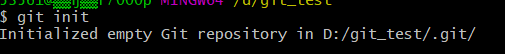

   ​                                                                                         图1

   

3. 管理

   ```
   git status(检测该文件夹下的文件状态)
   git add git_2.txt(管理git_2文件)
   git status(继续检测文件状态，发现被管理的文件变成绿色)
   git add .(管理该文件夹下的所有文件)
   ```


4. 生成版本

   ```
   git commit -m 'version_1'(把上述管理的文件生成第一个版本)
   //不过在你提交第一次版本之前，git会先询问你电脑的邮箱和你的用户名，则需要输入以下命令
   git config --global user.email "*****@qq.com"
   git config --global user.name "梁**"
   //接着在输入生成版本命令即可
   //若在第一个版本上修改了内容，即重复上述步骤并生成第二个版本即可(除了git config之外)
   //最后生成两个版本之后可以使用下列命令查看你的所有版本
   git log
   ```

   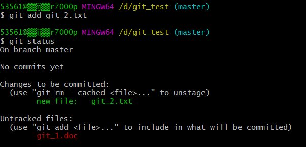

   ​                                                                                             图2

   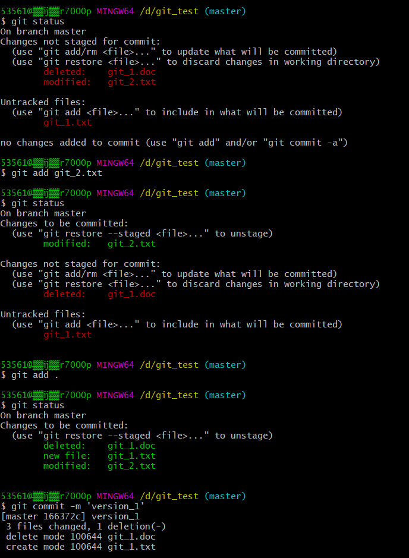

   ​                                                                                             图3

   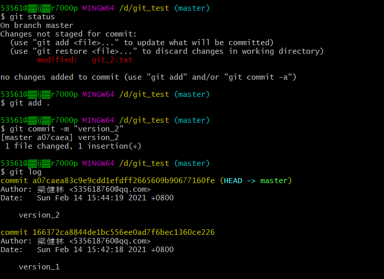

   ​                                                                                             图4

5. 总结(生成版本的步骤)

   ```
   git init //初始化git，使git获得管理文件的权利
   git status //检测需要管理文件的状态(红色表示未管理，绿色表示已经管理)
   git add '文件名'& git add . //管理文件&管理所有文件
   git commit -m '版本号' //把管理起来的文件生成一个版本
   git log //查看自己的版本名字以及创建版本的时间
   ```

   

## 第五章、运行git的注意事项

1. 当git生成版本之前，需要先进行信息的配置，即配置用户的用户名以及用户邮箱(email、name)，git的语法如下：

   ```
   git config --global user.email "邮箱名"
   git config --global user.name "用户名"
   ```

   

## 第六章、git的三大区域

1. 工作区：工作区存放新的文件，通过git add 把工作区的文件放入到暂存区中。

2. 暂存区：通过 git commit -m 命令把暂存区的文件生成版本。同时也可以回滚回工作区。

3. 版本库：存放版本的仓库。

   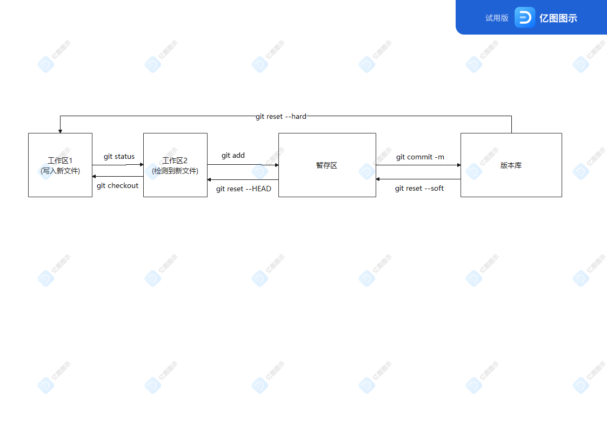

## 第七章、回滚

1. 命令如下：

   ```
   git log 
   git reset --hard 回滚到上一个版本的编号(例如有1和2两个版本，不要2版本，要1版本，则需要回滚到1版本，即提供1版本的版本编号);同时也可以使用 git reset HEAD^ 来进行对上一个版本的回滚，前者可以根据版本的编号进行特定的回滚，而后者是只能对上一个版本进行回滚，两者的用法不一。
   git reflog
   git reset --hard 回到下一个版本的编号// 两个编号不一样的 这个要注意
   ```

   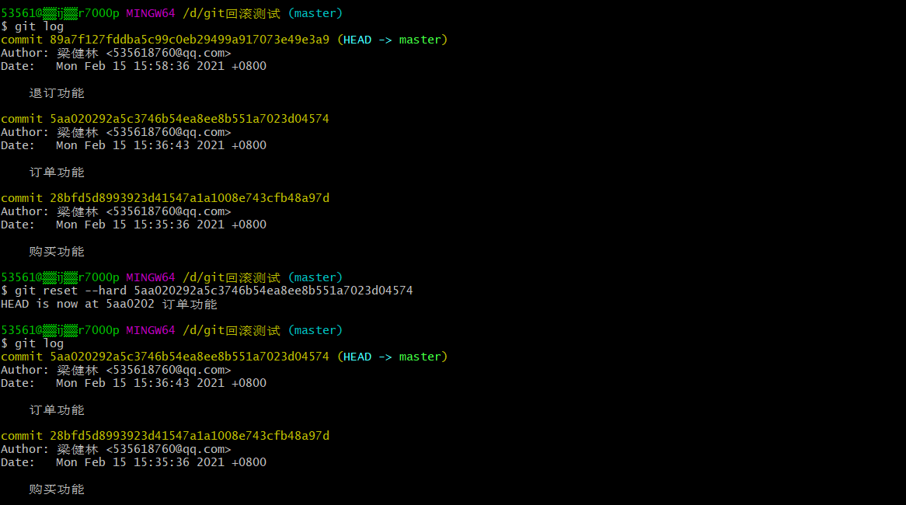

   ​                                                                                           图5

   

   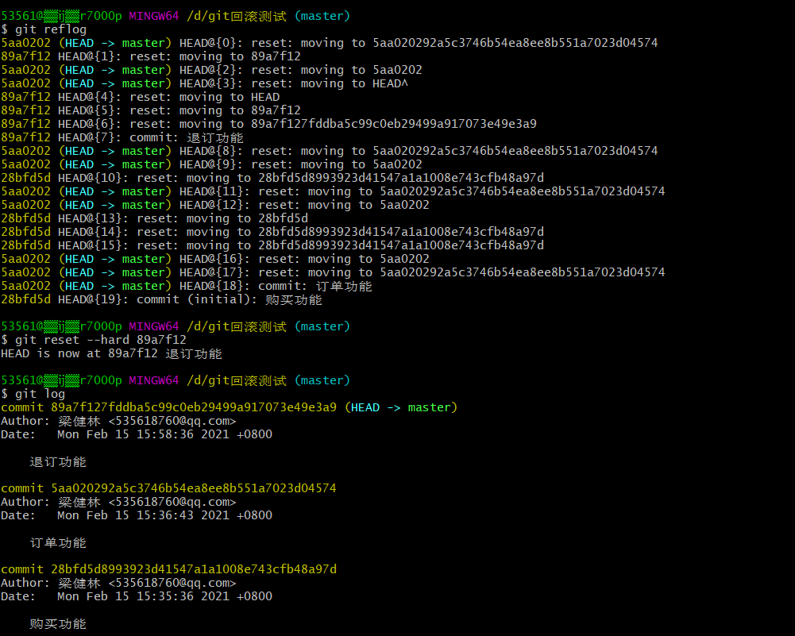

   ​                                                                                                 图6

2. 提示：这里的版本地址非常长，要想复制地址的话，要先选中地址，点击按键ctrl+ins复制，shift+ins粘贴即可。

## 第八章、git命令的小总结

```
git init //初始化git，使git有管理文件的权限
git add //(工作区2——>暂存区)
git commit '版本名称' //(暂存区——>版本库)
git log 
git reset --hard //版本回滚(版本库——>工作区1)
git reset --soft//版本回滚(版本库——>暂存区)
git reset --HEAD //版本回滚(暂存区——>工作区2)
git reset checkout //(工作区2——>工作区1) 工作区分为两块，第一块已管理的文件，这里称为工作区1，第二块是git检测到的文件，这里称为工作区2
git reflog 
```


## 第九章、初识分支

1. 若版本二是由版本一通过修改功能而得来的，那么版本二只需要存放修改的内容，而原先版本一的功能可以不用写在版本二里。

   **Q：如果版本二里面没有版本一原先的代码，那么怎么保持着拥有版本一原先并未需要修改的功能呢？**

   版本二会有一个指针指向版本一，那么版本二就可以运用版本一中不需要修改的代码来使用了，这样可以有效的提高生成版本的效率。

   **Q：为什么会说是分支？**

   因为一个版本可以被多个版本所指向，即可以在这个版本上同时扩展多个功能(版本)，最后再将这两个功能(版本)合成一个版本，例如订单功能里可以分出两个功能：支付功能和退单功能，那么这两个功能可以分给两组人去做，等两组人都完成了在把这两个功能合起来生成一个新的版本，这就是说是分支的原因。

## 第十章、紧急修复线上bug的思路

紧急修复线上bug的方法就是利用分支的思想，当在开发新功能的时候发现之前开发的功能出现bug的时候，我们可以在之前的版本中创建多一个分支，这个分支是专门用来修复bug的，当bug修复完成之后呢，再把它传回之前的版本中，从而开发新功能的版本不会有任何的影响从而发生开发时间的推移。

## 第十一章、基于分支修复线上bug的具体过程

```
git branch 分支名称 //创建分支
git checkout 分支名称 //切换分支，在这里开发的功能不影响主干路master
git add./ git commit -m / 创建版本
git checkout master /切换回主路
git merge 分支名称 /合并分支
注意 合并分支的时候一定要先返回到主干路上
```

```
例子如下：
git branch dev
git checkout dev //创建dev分支并切换到该分支上
git add./ git commit -m //在该分支上上传版本
git checkout master //切换成主干路
git merge dev //把dev分支合并上主干上
```


​                                                                                                    图7

## 第十二章、命令总结和工作流

1. 查看分支

```
git branch
```

2. 创建分支

```
git branch 分支名称
```

3. 切换分支

```
git checkout 分支名称
```

4. 合并分支

```
git checkout master (若已在master上则不需要再次切换)
git merge 分支名称
```

5. 删除分支

```
git branch -d 分支名称
```

6. 工作流

   最简单的工作流起码要有两条分支，一条是主干线master，另外一条是开发功能时候所用到的分支dev。在分支dev流上可以是功能的许多测试版，但是到了主干线master上面一定要是功能版本的正式版。

# 二、github的学习及应用

## 第一章：github

1. github是一个在云端上的代码托管，要使用github需要做到以下几点：
   - 注册github账号
   - 创建一个仓库
   - 把本地代码推送到远程仓库

## 第二章、基于github做代码托管

现在github上创建属于自己的仓库，并为自己的仓库命名。

然后创建完自己的仓库之后github会给仓库定义一个地址，然后我们可以通过git把自己管理的版本上传到github中，具体代码如下：

```
1、git remote add origin https://github.com/********0136/-.git  //把自己仓库的地址命名成origin，以后就可以使用origin来代替自己的仓库地址了。
2、git push -u origin master //把master主干线管理的版本上传到自己的仓库中
3、git push -u origin 其他分支的名称 //把任意分支管理的版本上传到自己的仓库中
4、注意：在第一次在(各种支线)上传或者下载代码的时候可能会出现上传失败或者是下载失败的报错(failed to push some refs to git)，原因是github中的README.md文件不在本地代码目录中，这时候只需要加上：git pull --rebase origin master/其他支线名称， 即在github的仓库中的README.md文件下载到本地目录中
5、git clone 仓库地址 //在仓库地址下下载版本文件(比如在家里面下载在公司里上传的版本内容)
```

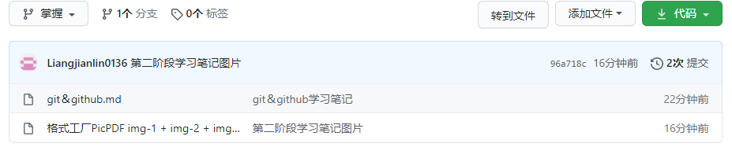

​                                                                                            图1

## 第三章、公司和家里的代码上传以及下载

1. 在公司进行代码的编写及上传(第一次)

   ```
   1、git branch dev //创建dev分支
   2、git checkout dev //切换到dev分支
   3、git merge master //把master分支上的内容合并上dev分支上，因为master分支上的代码是最新的，而且是没有bug
   编写代码
   4、git add. /commit -m '公司编写的代码' //生成版本，上传代码
   5、git push origin dev //把生成的版本上传到github仓库中
   ```

   

2. 在家里对公司代码进行下载以及继续编写，接着编写完成后继续上传

   ```
   1、git checkout dev //切换回dev分支中，因为要保持分支一致，这样可以保持上传代码的准确性以及规范性
   2、git pull origin dev //把dev代码拉下来，这里不用clone是因为clone会把该仓库的所有线路的内容都拉下来，每次都这样拉下来的话会降低效率，而且文件占领的空间也比较多
   3、编写代码
   4、git add. / commit -m '在家编写的代码' //生成版本，上传代码
   5、git push origin dev //把生成的版本再次上传到github仓库中
   ```

   

3. 在公司进行代码的下载以及再次的上传（第二次）

   ```
   1、git checkout dev
   2、git pull origin dev
   3、编写代码
   4、git add ./ git commit -m '在公司上传的第二次代码'
   5、git push origin dev
   ```


4. 开发功能完毕，准备上线

   ```
   1、git checkout master //切换成主分支master，因为master就是放正式上线的版本的
   2、git merge dev //合并dev功能支线
   3、git push origin master //把正式版放到github仓库中
   ```

   

## 第四章、忘推送代码

情景如下：当在公司忘记提交当天编写的代码到github上，回到家后又编写了新的代码并且上传到github上，第二天回到公司的时候就要对今天以及昨天的代码进行合并，但是合并的途中会产生冲突，比如代码可能重复了，核实后在git上面通过vim进行修改并且整合，最后上传到github即可。


## 第五章、rebase应用场景一

把多个提交记录整合成一个提交记录

1. 方法一

```
1、git rebase -i 版本号 //表示此版本到最新的一个版本的所有版本整合成为一个版本
```


​                                                                                图2


2. 方法2

   ```
   1、git rebase -i HEAD~2 //表示找到从当前开始最近的两条记录进行合并
   ```


3. 注意

   合并版本时，不要合并已经提交上github里的版本，如果合并了github上面的版本然后在重新提交上去github的话，那么原先存在github的版本就会变得模糊，当你修改了合并版本的时候，那么原来在github上的那个版本也要进行修改，避免记录不一致，这样工作量就会很大而且很麻烦，所以不要合并已经上传之后的版本。

   

## 第六章、rebase应用场景二

rebase可以是支线版本和主线版本整合的时候更加方便，之前学的方法有：

1. merge方法(例如将支线版本dev合并到主线版本master)

   ```
   1、git checkout master
   2、git merge dev
   ```

   

   - 其流程图如下：

     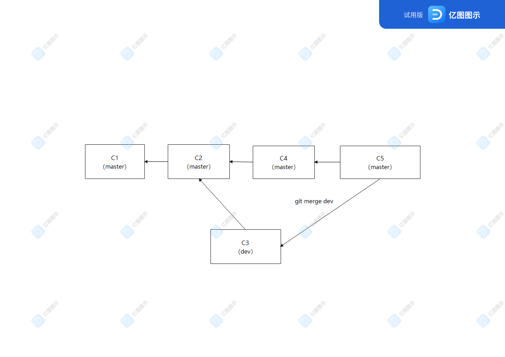

2. rebase方法（直接把支线版本dev整合到当前master版本中)

   ```
   1、git checkout dev  //先切换到dev分支
   2、git rebase master //在将dev分支直接插到master分支上
   3、git checkout master //再次切换到master分支上
   4、git merge dev //把插入的dev功能合并到master分支上，形成一条线路 
   ```

   

   - 其流程图如下：

     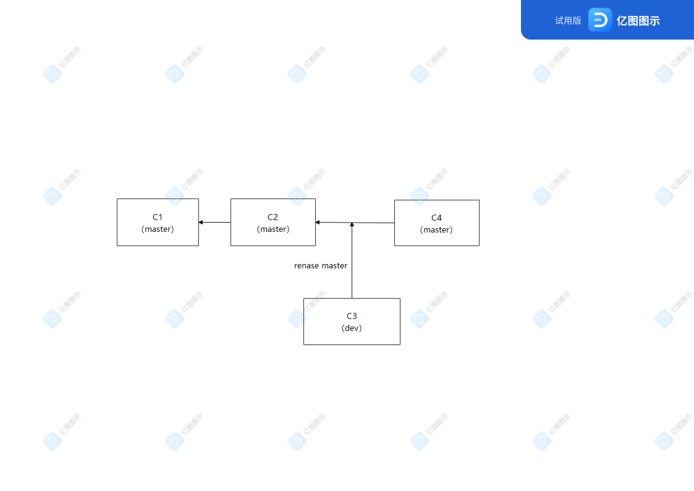

     最后变成一条主干线，支线数目为0

     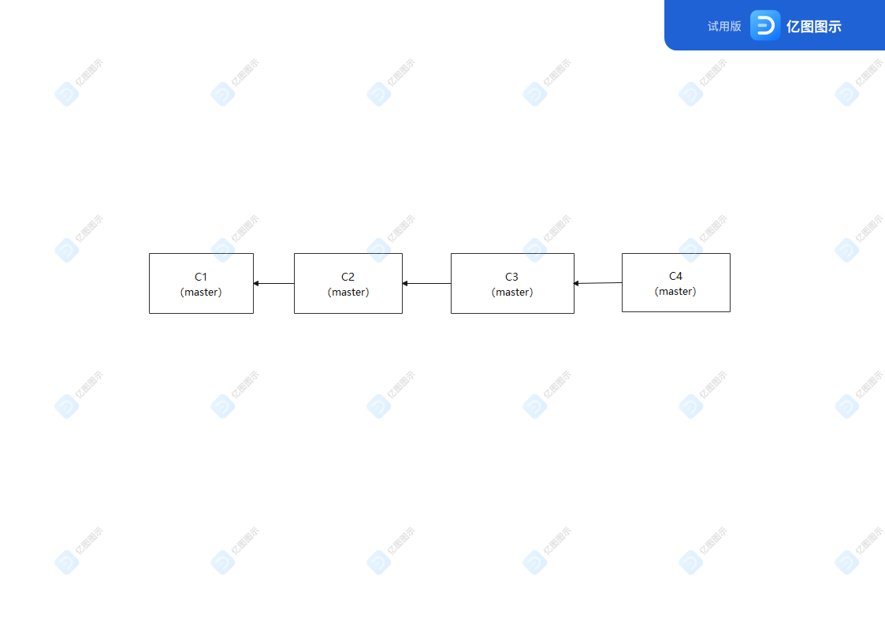


## 第七章、rebase应用场景三及注意事项

1. 应用场景：当在公司中写了代码只上传到本地服务器而没上传到github上，而回到家后又写了另外一个功能的代码并把该代码上传到了github，第二天再把在家里写的代码整合到昨天没有上传到github的代码中。会有以下这么个操作：

```
1、git pull origin dev //这个操作会导致在功能合并的时候产生分叉(代码冲突)，因为git pull origin dev相当与
git fetch origin dev + git merge dev 
2、git fetch origin dev  + git rebase origin/dev //这个操作则不会导致代码重复而引起的冲突
```

2. 注意事项：若在执行rebase时发生冲突了，不要慌! 先把冲突给解决了，在把解决完的版本上传之后，接着重新启动rebase执行整合即可：

```
1、git add 解决完冲突的版本.XXX
2、git commit -m '解决完冲突的版本名'
3、git rebase --continue //重启rebase
```


## 第八章、beyongd compare 快速解决冲突

1. 安装beyond compare

2. 在git中配置 beylond compare

   ```
   1、git config --local merge.tool bc3
   2、git config --local mergetool.bc3.path 'belond compare所存放的地址'
   3、git config --local mergetool.keepBackup false
   //这三条就把beylond compare配置到了git中了，这里注意一点的就是：这里的配置文件使用的是--local，就是说明beylond compare只适用于该文件，其他文件下的git不可以使用，得重新配置。
   4、git mergetool //若该文件下有冲突，则beylond compare自动启动，解决冲突；若该文件下没有冲突，则提示：No file need merging
   ```

   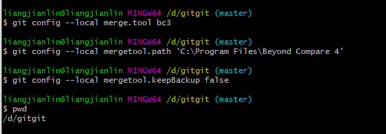

   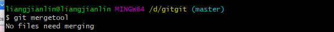

## 第九章、命令总结

1. 添加远程连接

   ```
   git remote add origin 地址
   ```

   

2. 推送代码至远程服务器

   ```
   git push origin 分支名称
   ```

   

3. 下载远程服务器上面的全部分支代码

   ```
   git clone origin
   ```

   

4. 下载远程服务器上面的部分代码

   ```
   git pull origin 分支名称
   或是 git fetch origin 分支名称 + git merge 分支名称
   ```

   

5. 保持代码整合的时候不产生冲突

   ```
   git rebase 分支名称
   ```

   

# 三、多人协同开发

## 第一章、多人协同开发gitflow工作流思路

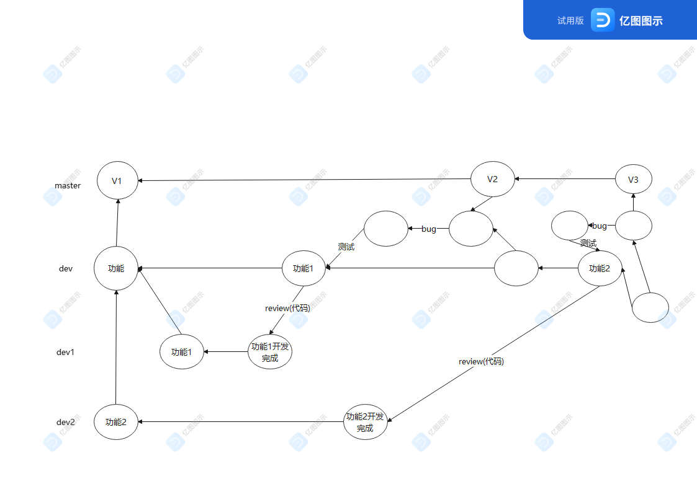

思路如下：

- 每个项目划分成多个大的功能
- 每个大的功能可以拆分成很多小功能供不同部门及个人开发
- 每个小功能开发完成后交由项目经理或部门负责人进行代码检查(review)
- 代码检查通过后将进行代码测试，若有bug及时修改并整合，若无bug或者bug已经修改完毕则可以进行功能的上线

## 第二章、多人协同开发之创建初始项目和版本

1. 方法一：直接邀请其他人参与你的项目开发：先创建个人的项目仓库，创建完成后点击settings—>Manage access—>invite a collaborator即可发出项目协作开发邀请，之后被邀请人会收到一封邮件，询问被邀请人是否加入参与项目开发，同意之后即可参与开发。

   

   

2. 方法二：先创建一个组织(New organization)，然后在组织中可以创建若干个项目，接着邀请不同的成员赋予不同的权限来对不同的项目进行开发。

   

   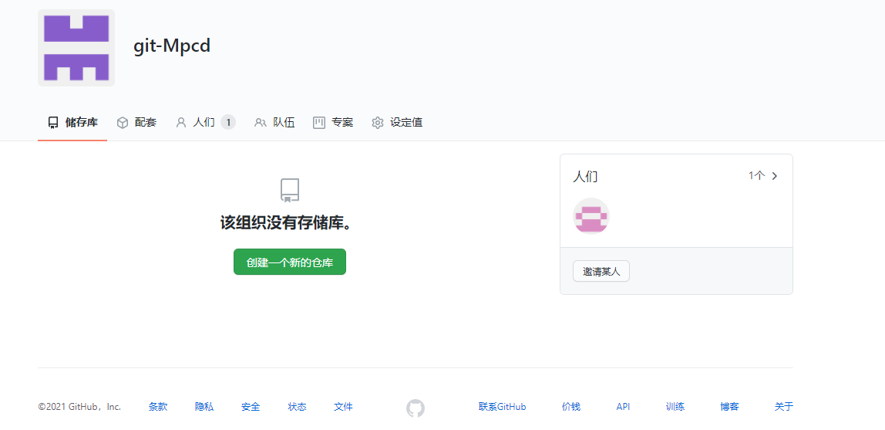

   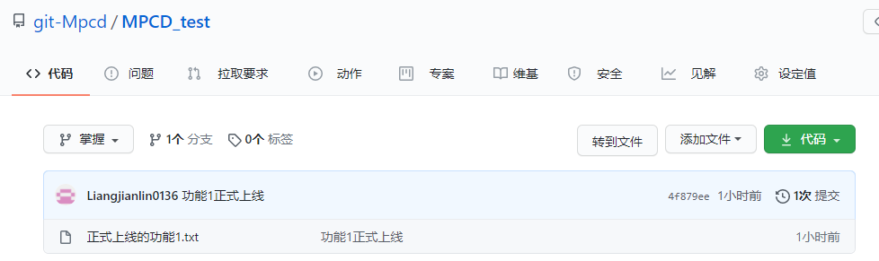

3. 注意：因为每个版本的版本号都是一串非常长的代码，所以为了简化版本号，我们可以这样操作：

   ```
   1、git tag -a v1 -m "第一版"  //把第一版的功能设置一个标签v1
   2、git push origin --tags
   ```

   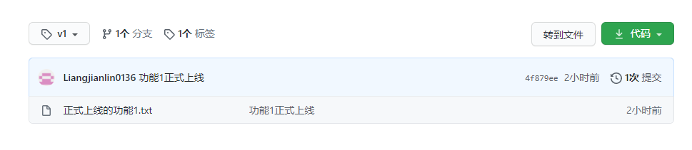

## 第三章、多人协同开发之邀请成员(1)

步骤：

- 点击邀请某人

- 搜索到要邀请的用户，发送邀请邮件

- 被邀请的用户在邮箱上点击确认即可加入组织

  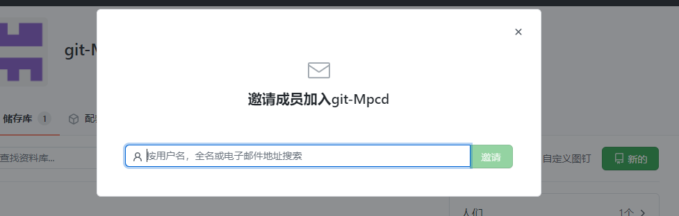

## 第四章、多人协同开发之邀请成员参与开发

```
1、git clone origin //成员需要先下载源代码
2、git checkout dev //切换到开发功能的分支上
3、git branch ddz //创建属于自己功能部分的分支
4、git checkout ddz
5、git push origin ddz //把开发完的代码上传到分支上面
```

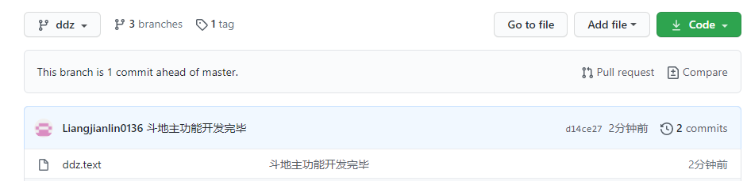

## 第五章、多人协同开发之代码review

先对项目进行配置：

1. 给分支添加规则，这里添加的规则就是当合并dev分支的时候，要进行一次review

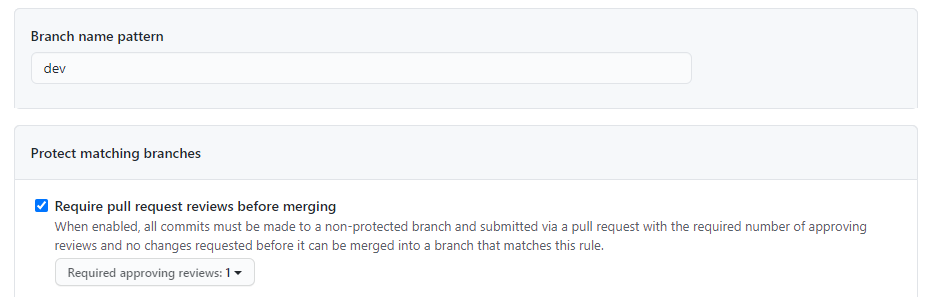

2. 规则创建完成

   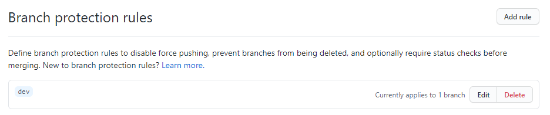

3. 提交ddz功能至dev中进行一次review

## 第六章、多人协同开发之测试上线

1. 在功能分支上创建测试分支

```
git checkout dev
git checkout -b release  这句代码相当于git branch release + git checkout release
git push origin release //把要测试的代码推送到测试分支中
```

2. 测试完成之后在利用github上面的pull request将release分支合并到master分支上面，然后将其上线；而后再把release分支合并到dev分支上面，使dev分支的bug清除
3. 删除release分支

# 四、其他学习内容及结课

## 第一章、配置文件存放三个位置

1. 项目配置文件(只在该项目中生效)

   ```
   git config --local user.name 'liangjianlin'
   git config --local user.email 'liangjianlin@xxx.com'
   ```

2. 全局配置文件(对所有文件项目都生效)

   ```
   git config --global user.name 'liangjianlin'
   git config --global user.email 'liangjianlin@xxx.com'
   ```

3. 系统配置文件(对本系统中的所有文件都生效)

   ```
   git config --system user.name 'liangjianlin'
   git config --system user.email 'liangjianlin@xxx.com'
   
   注意：修改系统的配置文件需要有root权限
   ```

   

## 第二章、gitignore忽略文件

让git不在管理当前目录下的某些文件

```
.gitignore文件下：
*.h
！a.h
若出现以上代码的话，说明gitignore会忽略掉除了a.h的所有.h文件
```

更多参考：https://github.com/github/gitignore


## 第三章、github做任务管理

1. issues:在github上提交一个issues给特定的人(项目开发人员等等)，issues包括提问题或bug等等，然后等那边的人回复即可
2. wiki：wiki相当于给自己上传的项目进行介绍(项目文档)，供其他人观看参考


